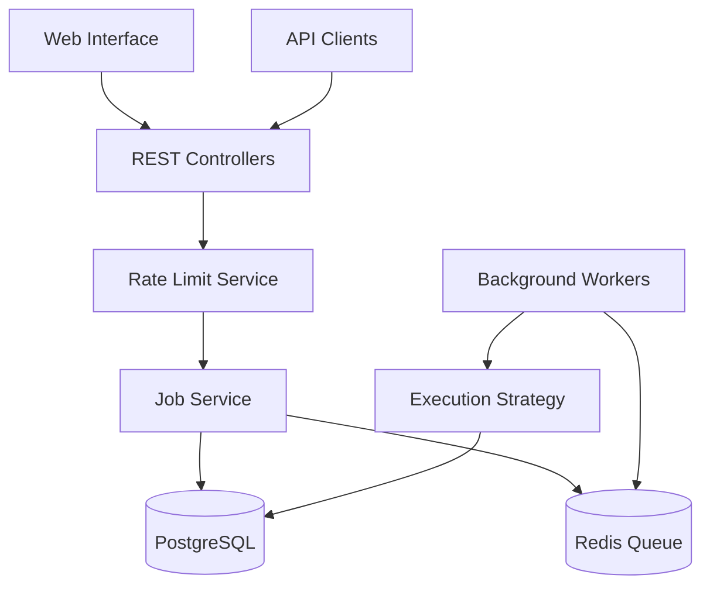

# SimplyDone: Enterprise-Grade Job Orchestration

SimplyDone is a high-performance, distributed background job scheduling system engineered for reliability, observability, and scale. Built on a Spring Boot foundation with Redis-backed priority queuing and PostgreSQL state persistence.

## 🚀 Key Advantages

### Dual-Lane Priority Architecture
- **Critical Path Isolation**: Segregated `High` and `Low` priority lanes ensure urgent transactions are never delayed by background maintenance.
- **Dynamic Worker Scaling**: Strategy-based execution engine that accommodates diverse workloads from simple API pings to complex data transformations.

### Enterprise Observability
- **Real-time Diagnostics**: Deep integration with Spring Actuator for JVM health, thread state, and Redis latency monitoring.
- **Dead Letter Management**: Integrated DLQ with automated retry logic and a dedicated administration interface for failure recovery.

### Secure-by-Design
- **Credential Isolation**: Zero-config secrets management via environment variables.
- **Rate-Limiting Infrastructure**: Redis-backed sliding window rate limiting to protect downstream services and internal resources.

## 🛠 Technology Stack

- **Core**: Java (Spring Boot 3.x), Hibernate/JPA
- **State**: PostgreSQL (Persistence), Redis (Queuing & Rate Limiting)
- **Frontend**: Vanilla ES6+, Custom Modular CSS (Light Mode Optimized)
- **Infra**: Docker, Render Blueprints, Multi-stage CI/CD ready

## 🏗 System Architecture



## 📋 Operational Capabilities

1. **EMAIL_SEND**: SMTP integration with HTML template support.
2. **DATA_PROCESS**: High-throughput CSV/JSON transformations.
3. **API_CALL**: Distributed webhook and REST integration with custom retry logic.
4. **FILE_OPERATION**: Managed asset movement and lifecycle cleanup.
5. **REPORT_GENERATION**: Asynchronous PDF and HTML document production.

## 🏁 Quick Start

### 1. Local Environment (Docker)
```bash
# Clone and initialize
git clone https://github.com/learnerview/SimplyDone.git
cp .env.template .env

# Launch infrastructure
docker-compose up -d
```
Access the mission control dashboard at `http://localhost:8080`.

### 2. Production Deployment (Render)
SimplyDone is optimized for Render via the included `render.yaml`. Connect your repository and deploy the entire stack—including managed databases—in minutes.

## 📚 Technical Documentation

- [Getting Started Guide](docs/GETTING_STARTED.md) - Infrastructure setup and initial configuration.
- [Technical Architecture](docs/TECHNICAL_ARCHITECTURE.md) - Deep dive into system design and data flow.
- [REST API Reference](docs/REST_API_REFERENCE.md) - Comprehensive endpoint documentation.
- [Deployment & Operations](docs/DEPLOYMENT_OPERATION_GUIDE.md) - Production scaling and maintenance.

---
*Powered by the SimplyDone Core Team.*
