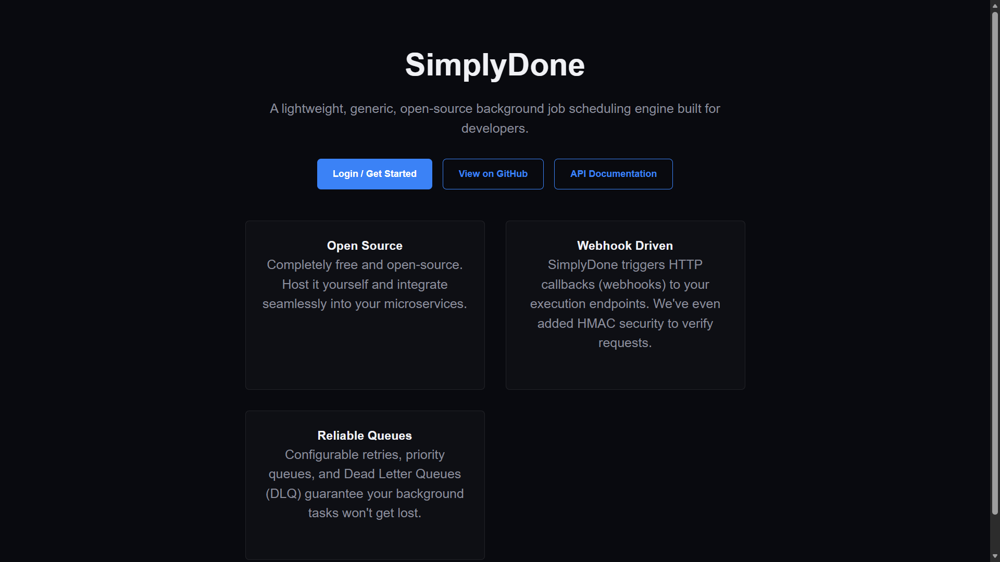
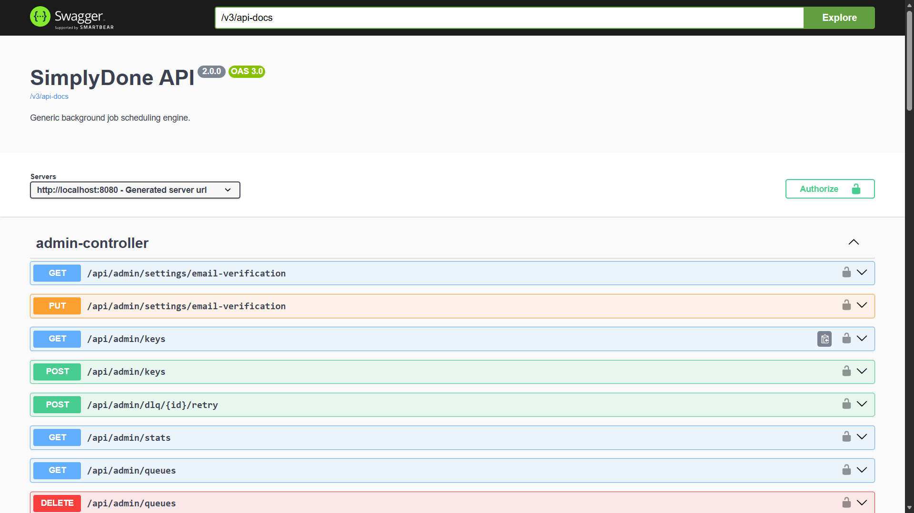
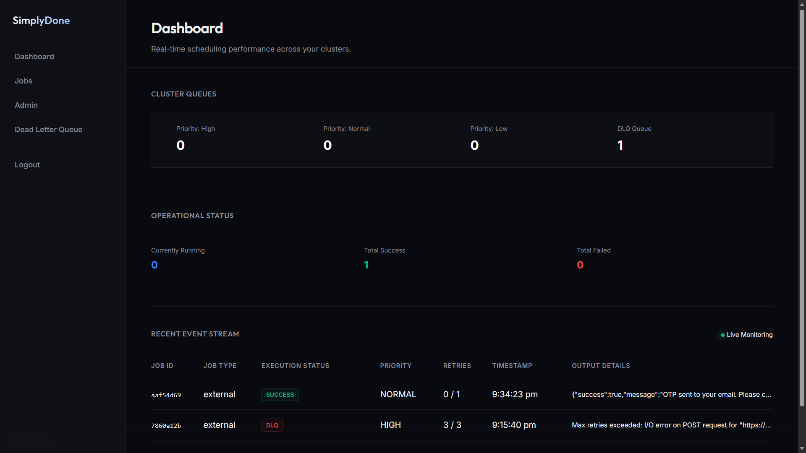
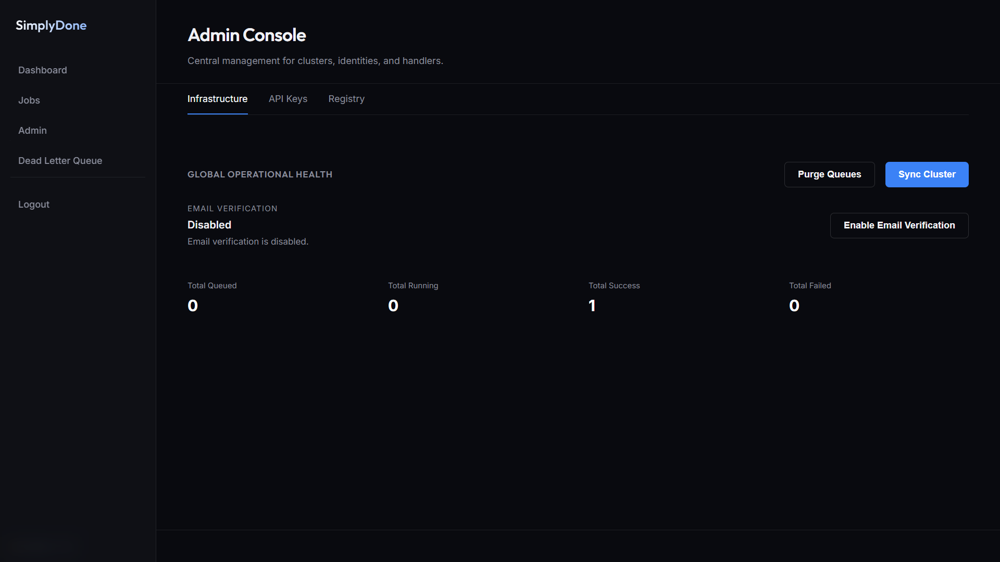
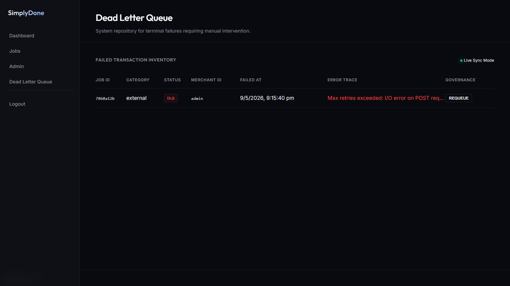

# SimplyDone

SimplyDone is a high-performance, multi-tenant background job scheduling and execution system built with Spring Boot. It provides a reliable bridge for asynchronous processing across microservices, ensuring that long-running or distributed tasks are executed with priority-aware fairness, strict isolation, and guaranteed delivery.

## Why SimplyDone

Most distributed architectures struggle with reliable background processing. SimplyDone addresses these core challenges:

- **Fairness at Scale**: Uses a **Deficit Round-Robin (DRR)** scheduler to ensure that high-priority transactional tasks (like payment confirmations) are never starved by low-priority bulk tasks (like analytics exports).
- **Lease-Based Safety**: Jobs are claimed with an atomic lease. If a worker process crashes mid-execution, the lease expires and the job is automatically recovered, preventing silent failures.
- **Tenant Isolation**: Designed for SaaS architectures. Every job, metric, and log is scoped to a "Producer ID" associated with an API Key.
- **Zero-Polling Visibility**: Integrated **Server-Sent Events (SSE)** provide a live, real-time feed of job state transitions to your dashboard or monitoring tools.
- **Webhook Authenticity**: Every execution request is signed with **HMAC-SHA256**, allowing your services to verify that incoming tasks originated from SimplyDone.

---

## Getting Started: The Workflow

### 1. Registration
Initiate your account by visiting the `/signup` page or using the Auth API.
- **Request OTP**: Submit your email to receive a 6-digit verification code.
- **Verify & Onboard**: Enter the OTP to receive your permanent **API Key** and **Producer ID**.

### 2. Submitting a Job
Once you have an API key, you can submit jobs via HTTP.
```bash
curl -X POST http://localhost:8080/api/jobs \
  -H "X-API-KEY: sd_sk_live_..." \
  -H "Content-Type: application/json" \
  -d '{
    "jobType": "order_processing",
    "idempotencyKey": "order_789",
    "priority": "HIGH",
    "execution": {
      "type": "HTTP",
      "endpoint": "https://api.yourdomain.com/webhooks/process"
    },
    "payload": { "orderId": "789", "customer": "Alice" }
  }'
```

### 3. Monitoring
Use the **Dashboard** at `/dashboard` to see your jobs move from `QUEUED` to `RUNNING` and finally `SUCCESS` or `FAILED`. Failed jobs move to the **DLQ** after exhausting retries.

---

## Core Concepts

### Priority Queues
SimplyDone manages three internal queues:
- **HIGH**: Used for time-sensitive, user-facing actions.
- **NORMAL**: The default for standard background tasks.
- **LOW**: Used for bulk processing, migrations, or non-urgent cleanup.
The scheduler distributes worker capacity based on weights (default: 70% High, 20% Normal, 10% Low).

### Idempotency
To prevent duplicate job creation due to network retries, SimplyDone requires an `idempotencyKey`. If you submit the same key twice within the same producer scope, the API will return the existing job status rather than creating a new one.

### The Lease Model
When a worker claims a job, it sets a `lease_owner` and a `visible_at` timestamp. 
- While the lease is active, other workers cannot see the job.
- If the worker fails to update the job state before `visible_at` (e.g., due to a crash), the job becomes visible again and is picked up by a recovery reaper.

### Retry & Backoff
Failures trigger automatic retries with **Exponential Backoff**:
- **Initial Delay**: 5 seconds (default)
- **Multiplier**: 2.0 (e.g., 5s, 10s, 20s...)
- **Max Attempts**: Configurable per job (default: 3)

---

## API Reference

### Standard Response Envelope
All API responses follow this consistent structure:
```json
{
  "success": true,
  "message": "Action completed",
  "data": { ... },
  "timestamp": "2026-05-10T10:00:00Z"
}
```

### Authentication APIs

#### Request Signup OTP
`POST /api/auth/signup/request-otp`
- **Body**: `{ "email": "user@org.com", "organizationName": "Acme Corp" }`
- **Note**: Sends a code to the email. Expires in 10 minutes.

#### Verify OTP & Get Key
`POST /api/auth/signup/verify-otp`
- **Body**: `{ "email": "user@org.com", "otp": "123456" }`
- **Returns**: Your permanent `apiKey` and `producerId`. **Keep these secret.**

### Job Management APIs

#### Submit Job
`POST /api/jobs`
- **Headers**: `X-API-KEY: <your_key>`
- **Body Fields**:
    - `jobType` (String, required): Category of your job.
    - `idempotencyKey` (String, required): Unique identifier for this job instance.
    - `priority` (Enum: `HIGH`, `NORMAL`, `LOW`, optional): Defaults to `NORMAL`.
    - `execution` (Object, required):
        - `type`: Only `HTTP` is currently supported.
        - `endpoint`: The URL SimplyDone will POST the payload to.
    - `payload` (Object, optional): Data passed to your endpoint.
    - `nextRunAt` (ISO8601, optional): Schedule for the future.
    - `maxAttempts` (Integer, optional): Max retries.

#### List Jobs
`GET /api/jobs?page=0&size=20`
- Returns a paginated list of jobs for your organization.

#### Get Job Detail
`GET /api/jobs/{id}`
- Returns full job status, result body, and execution logs.

#### Cancel Job
`DELETE /api/jobs/{id}`
- Only `QUEUED` jobs can be cancelled.

#### Queue Health
`GET /api/jobs/health`
- Returns throughput, success rates, and current queue depths for your organization.

---

## Webhook Signature Verification

SimplyDone signs every execution request using your API key. To ensure the request is authentic, you should verify the `X-SimplyDone-Signature` header.

### Verification Logic
1. Extract the header `X-SimplyDone-Signature`. It looks like `sha256=<hex_digest>`.
2. Compute the **HMAC-SHA256** of the raw request body using your **API Key** as the secret.
3. Compare your computed digest with the hex digest in the header using a **constant-time comparison** function.

### Python Example
```python
import hmac
import hashlib

def verify_simplydone_webhook(request_body, signature_header, api_key):
    if not signature_header.startswith("sha256="):
        return False
    received_hash = signature_header[7:]
    computed_hash = hmac.new(
        api_key.encode('utf-8'),
        request_body.encode('utf-8'),
        hashlib.sha256
    ).hexdigest()
    return hmac.compare_digest(received_hash, computed_hash)
```

### Node.js Example
```javascript
const crypto = require('crypto');

function verifySimplyDoneWebhook(requestBody, signatureHeader, apiKey) {
    if (!signatureHeader.startsWith('sha256=')) return false;
    const receivedHash = signatureHeader.substring(7);
    const computedHash = crypto
        .createHmac('sha256', apiKey)
        .update(requestBody)
        .digest('hex');
    return crypto.timingSafeEqual(
        Buffer.from(receivedHash),
        Buffer.from(computedHash)
    );
}
```

---

## Configuration (Environment Variables)

| Variable | Description | Default |
|----------|-------------|---------|
| `PORT` | Server listening port | `8080` |
| `SPRING_PROFILES_ACTIVE` | Active roles (`api`, `worker`, `prod`) | `prod,api,worker` |
| `SPRING_DATASOURCE_URL` | PostgreSQL JDBC URL | Required |
| `REDIS_URL` | Redis connection URL | `redis://localhost:6379` |
| `MAIL_HOST` | SMTP server host | `smtp.gmail.com` |
| `MAIL_USERNAME` | SMTP username | Optional |
| `MAIL_PASSWORD` | SMTP password | Optional |
| `ADMIN_INITIAL_SECRET` | Secret to bootstrap the first admin key | Required for setup |
| `APP_URL` | Base URL of SimplyDone (for emails) | `http://localhost:8080` |

---

## Project Structure

```text
src/main/java/com/learnerview/simplydone/
├── config/         # Security, Redis, and Web configurations
├── controller/     # API Controllers (Auth, Jobs, Admin, SSE)
├── dto/            # Data Transfer Objects for API contracts
├── entity/         # Database Entities (Job, ApiKey, Logs)
├── mapper/         # Entity-DTO mapping logic
├── repository/     # Spring Data Repositories (Postgres & Redis)
├── service/        # Business Logic, DRR Scheduler, and Execution Engine
├── exception/      # Global Exception Handling (RFC 7807)
└── sdk/            # Minimal client and signature verification logic
```

---

---

## Troubleshooting

- **"Port already in use"**: SimplyDone defaults to port `8080`. You can change this by setting the `PORT` environment variable or overriding `server.port` in your properties.
- **Database Migrations Failing**: Ensure your PostgreSQL database is reachable and the credentials are correct. Flyway requires a schema history table, so ensure the database user has sufficient permissions.
- **Job Stuck in `RUNNING`**: This usually happens if a worker process crashes mid-job. The **Lease Reaper** automatically detects orphaned jobs and re-queues them after the lease expires (default 30s). Check worker logs for underlying crash causes.
- **`X-API-KEY` Rejected**: Every request must include the exact header name `X-API-KEY`. If you've lost your key, use the `/recover` self-service flow.
- **Webhooks Failing with 403**: This often indicates a signature mismatch. Ensure you are computing the HMAC-SHA256 of the **raw, unparsed** JSON request body.
- **Missing `ADMIN_INITIAL_SECRET`**: If you don't set this, the first admin key cannot be bootstrapped during unattended setup. You can still create an admin key manually in the database if needed.
- **Emails Not Sending**: Verify your `MAIL_HOST`, `MAIL_PORT`, and credentials. SimplyDone disables mail health checks to prevent application boot delays when your SMTP provider is slow or unreachable.

---

## Screenshots

Landing page:


OpenAPI / Swagger API:


Dashboard:


Admin Console:


DLQ:


---

## License
MIT