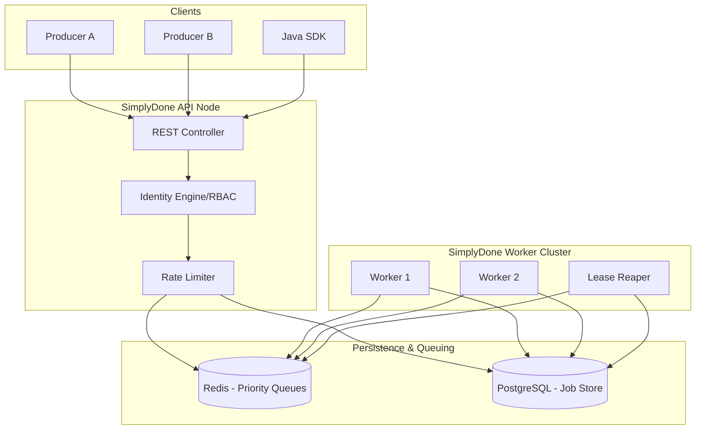
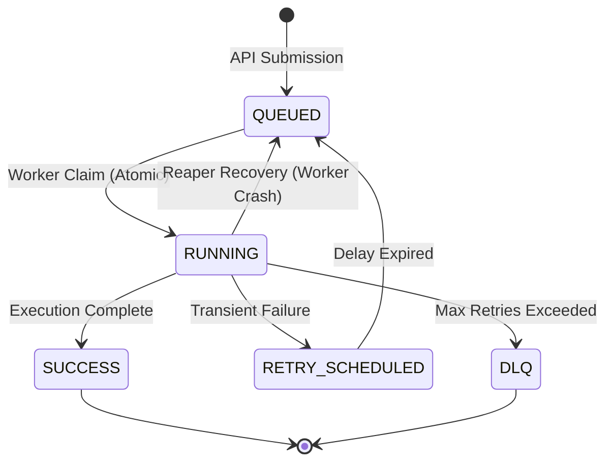

# SimplyDone: Enterprise Multi-Tenant Job Scheduling Platform

SimplyDone is a high-performance, distributed job scheduling and execution engine designed for multi-tenant SaaS environments. It provides a robust, production-ready backbone for managing background tasks, webhooks, and asynchronous workflows with strict data isolation, weighted priority queuing, and comprehensive fault tolerance.

## Core Value Proposition

SimplyDone solves the complexity of reliable task execution in distributed systems by providing:

- **Zero-Orphan Guarantee**: A background Reaper service ensures that no job is ever lost, even if a worker node crashes mid-execution.
- **Weighted Fairness**: Prevents low-priority background tasks from starving during high-load bursts of critical operations.
- **Plug-and-Play Multi-Tenancy**: Built-in tenant isolation allows you to expose task scheduling directly to your end-users or internal teams with zero risk of data leakage.
- **Cloud-Native Observability**: Real-time event streaming and cluster-wide metrics provide instant visibility into system throughput and health.

---

## Technical Architecture

SimplyDone is designed for high availability and horizontal scalability. The architecture separates the ingestion (API) layer from the execution (Worker) layer, allowing each to be scaled independently based on workload.



### Job Lifecycle

SimplyDone manages the complete lifecycle of a task, from submission to terminal state:



---

## Technical Implementation Deep Dives

### 1. Weighted Priority (Deficit Round-Robin)
SimplyDone implements a **Deficit Round-Robin (DRR)** scheduler to manage multiple priority lanes (High, Normal, Low). 

Unlike simple "high-first" schedulers which can cause total starvation of low-priority tasks, DRR uses a weighted deficit counter. If the weights are set to 70 (High), 20 (Normal), and 10 (Low), the system guarantees that over time, 70% of processing power goes to High-priority jobs, while Low-priority jobs are guaranteed at least 10% of throughput, even under maximum load.

### 2. Redis Atomic Claims (Compare-And-Swap)
To support multi-worker clusters without duplicate execution, SimplyDone uses a Redis-based optimistic locking pattern:
- **WATCH**: The worker watches the priority queue key in Redis.
- **MULTI**: Starts a transaction.
- **EXEC**: Atomically removes the job ID from the queue only if no other worker has modified the queue since the `WATCH` command.
This ensures **exactly-once claiming** at the queue level before the worker updates the job status in the database.

### 3. Identity Engine & Isolation
Security is built into the core. Every request to SimplyDone requires an `X-API-KEY`.
- The **Identity Engine** maps each key to a specific `producer` (Tenant ID).
- **Data Isolation**: All database queries are scoped by the producer ID. A tenant can never view, modify, or cancel a job belonging to another tenant.
- **RBAC**: Admin keys have elevated privileges to view cluster-wide metrics and manage the Dead Letter Queue (DLQ).

### 4. Resilience & The Lease Reaper
When a worker claims a job, it is granted a "lease" (default 30 seconds). If the worker crashes, the job remains in the `RUNNING` state in the database but is no longer in the queue.
The **Lease Reaper** service periodically scans for jobs that have exceeded their lease timeout without completion or heartbeat. It automatically re-enqueues these "orphaned" jobs, ensuring that every task is ultimately executed.

### 5. Sliding Window Rate Limiting
SimplyDone uses a Redis-backed **Sliding Window** rate limiter. Unlike fixed-window counters, the sliding window prevents "bursting" at the edge of time windows (e.g., 200 requests at 11:59:59 and another 200 at 12:00:01). It maintains a sub-second log of requests in a Redis `ZSET`, providing smooth and fair rate limiting for all tenants.

---

## Developer Guide

### Local Setup

1. **Configure Infrastructure**:
   SimplyDone requires Redis and PostgreSQL. The provided `docker-compose.yml` initializes these with production-optimized settings.
   ```bash
   docker-compose up -d
   ```

2. **Run the Application**:
   The application supports profiles for scaling.
   - Run both API and Worker: `mvn spring-boot:run`
   - Run API only: `mvn spring-boot:run -Dspring-boot.run.profiles=api`
   - Run Worker only: `mvn spring-boot:run -Dspring-boot.run.profiles=worker`

### API Specification

#### Submit a Job
`POST /api/jobs`

**Headers**:
- `X-API-KEY`: `<your_api_key>`
- `Content-Type`: `application/json`

**Body**:
```json
{
  "jobType": "webhook",
  "idempotencyKey": "order-12345",
  "priority": "HIGH",
  "payload": {
    "orderId": "ORD-99",
    "customer": "John Doe"
  },
  "execution": {
    "type": "HTTP",
    "endpoint": "https://api.yourdomain.com/webhooks/process"
  },
  "maxAttempts": 5,
  "timeoutSeconds": 60,
  "callbackUrl": "https://api.yourdomain.com/callbacks/job-status"
}
```

### SDK Integration (Java)

Include the minimal client in your project to interact with SimplyDone programmatically.

```java
// Initialize the client
SimplyDoneClient client = new SimplyDoneClient("https://simplydone.yournetwork.local", "sd_sk_live_12345");

// Define your payload
Map<String, Object> data = Map.of("userId", 42, "action", "sync_profile");

// Submit the job
String jobId = client.submitJob("https://internal.service/sync", data);
```

---

## Operational Considerations

### Scaling Strategy
SimplyDone instances are stateless. You can scale the **API nodes** to handle more incoming requests and the **Worker nodes** to handle higher job throughput. The system relies on Redis and PostgreSQL as the source of truth, allowing you to add or remove nodes on the fly without downtime.

### Dead Letter Queue (DLQ)
Jobs that fail all retry attempts (including exponential backoff) are moved to the DLQ. Administrators can inspect DLQ jobs via the dashboard or API to diagnose issues and manually trigger retries once downstream systems are restored.

## License

Copyright 2024 SimplyDone. Licensed under the MIT License.
